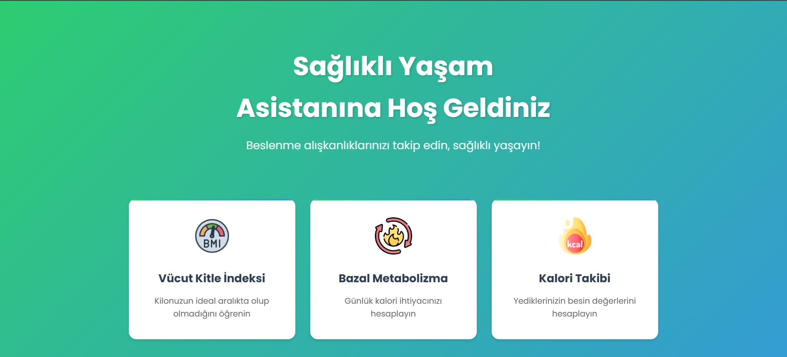

# 🥗 Sağlıklı Yaşam Asistanı



Sağlıklı Yaşam Asistanı, kullanıcıların beslenme alışkanlıklarını takip etmelerine, vücut kitle indeksi (BMI) ve bazal metabolizma (BMR) hesaplamalarına, yedikleri yiyeceklerin kalori ve besin değerlerini görmelerine yardımcı olan modern bir web uygulamasıdır.

## 🌐 Canlı Demo
Uygulamayı canlı olarak incelemek için: [https://proje.ahmetakaslan.com/](https://proje.ahmetakaslan.com/)

## 🎯 Amaç
Kullanıcıların sağlıklı yaşam hedeflerine ulaşmalarını kolaylaştırmak için, günlük besin ve kalori takibi ile kişisel sağlık hesaplamalarını tek bir platformda sunar.

## 🚀 Özellikler
- 🧮 **Vücut Kitle İndeksi (BMI) Hesaplama**
- 🔥 **Bazal Metabolizma (BMR) Hesaplama**
- 🍎 **Yiyecek Arama ve Besin Değeri Gösterimi**
- 📊 **Günlük Toplam Kalori ve Makro Takibi**
- 👤 **Kullanıcı Profili ve Kişiselleştirme**

## 🛠️ Kullanılan Teknolojiler
- 💻 **HTML5 & CSS3**: Modern ve responsive kullanıcı arayüzü
- ✨ **JavaScript (Vanilla JS)**: Dinamik işlemler ve API entegrasyonu
- 🐘 **PHP**: Backend işlemleri ve veritabanı yönetimi (Node.js alternatifi olarak PHP desteğiyle uyumlu)
- 🌐 **USDA FoodData Central API**: Yiyeceklerin besin değerlerini almak için harici API
- 🗄️ **MySQL**: (Opsiyonel) Kullanıcı ve veri yönetimi için veritabanı

## 📁 Proje Yapısı
```
food-calculator/
├── index.html
├── css/
├── js/
├── assets/
├── pages/
└── api/ (PHP backend)
```

## 📦 Kurulum & API Anahtarı Kullanımı

1. **Projeyi klonlayın:**
   ```sh
   git clone https://github.com/kullaniciadi/proje-adi.git
   ```

2. **API anahtarınızı ekleyin:**
   - USDA FoodData Central API anahtarınızı almak için [buradan](https://fdc.nal.usda.gov/api-key-signup.html) kayıt olun.
   - Proje dizininde `js/config.js` dosyasını **kendiniz oluşturun** ve aşağıdaki gibi doldurun:
     ```js
     const API_KEY = 'BURAYA_KENDİ_API_KEYİNİZİ_YAZIN';
     const API_URL = 'https://api.nal.usda.gov/fdc/v1';
     ```
   - Bu dosya güvenlik nedeniyle repoda **bulunmamaktadır** ve `.gitignore` ile koruma altındadır.

3. **Gizli dosyalar repoda yoktur!**
   - `js/config.js`, `.env` gibi dosyalar güvenlik için repoya eklenmez.
   - Uygulamayı çalıştırmak için bu dosyaları **kendiniz oluşturmalısınız**.

4. **Uygulamayı başlatın:**
   - Ana sayfayı (`index.html`) tarayıcınızda açarak uygulamayı kullanmaya başlayabilirsiniz.

> **Not:** API anahtarınızı kimseyle paylaşmayın ve herkese açık platformlarda yayınlamayın. Kendi anahtarınızı eklemeden uygulama çalışmaz.

## 🤝 Katkı ve Lisans
Katkıda bulunmak isterseniz lütfen bir pull request gönderin. Lisans bilgisi için proje sahibine danışabilirsiniz.

--- 